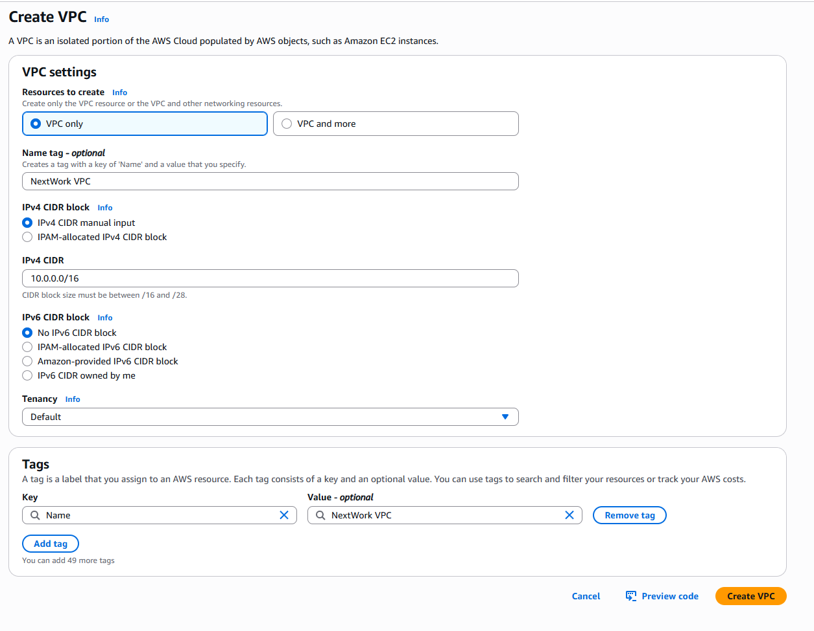
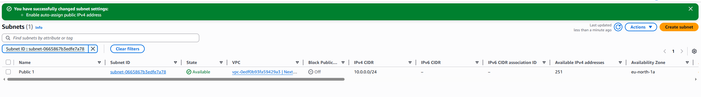
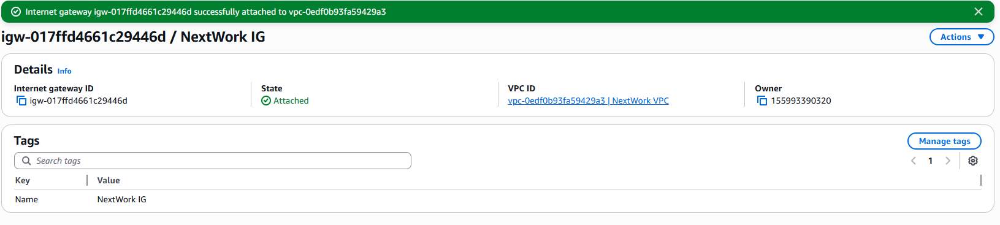

# AWS VPC Subproject

**Objective**: Build and configure a custom AWS Virtual Private Cloud (VPC) with a public subnet and Internet access.

---

## Architecture Overview


*Figure: VPC creation form with CIDR `10.0.0.0/16` and DNS settings enabled.*

---

## Implementation Steps

1. **Create VPC**

   * CIDR block: `10.0.0.0/16`
   * Enable DNS support & DNS hostnames

2. **Create Public Subnet**

   * CIDR block: `10.0.1.0/24`
   * Auto-assign public IPv4 enabled

   
   *Figure: Public subnet ready for Internet-facing resources.*

3. **Attach Internet Gateway**

   * Create IGW and attach to VPC

   
   *Figure: Internet Gateway successfully attached.*

4. **Configure Route Table**

   * Add route `0.0.0.0/0` → Internet Gateway
   * Associate with public subnet

5. **Verify Connectivity** *(Optional)*

   * Launch EC2 in public subnet with public IP
   * Test outbound access (`ping 8.8.8.8`) or SSH connectivity

---

## Key Concepts

* **VPC**: Private virtual network within AWS for resource isolation.
* **Subnet**: Segment of a VPC to group resources with similar network rules.
* **Internet Gateway**: Enables Internet access for resources in public subnets.
* **Route Table**: Defines traffic routing; custom tables allow directing traffic through IGWs or VPNs.

---

## Repository Structure

```
aws-projects/
└── vpc/
    └── project-01-vpc/
        ├── images/
        │   ├── vpc-setup.png
        │   ├── subnet-created.png
        │   └── internet-gateway-created.png
        └── README.md  ← this file
```

---

*Next up: VPC Traffic Flow and Security*
