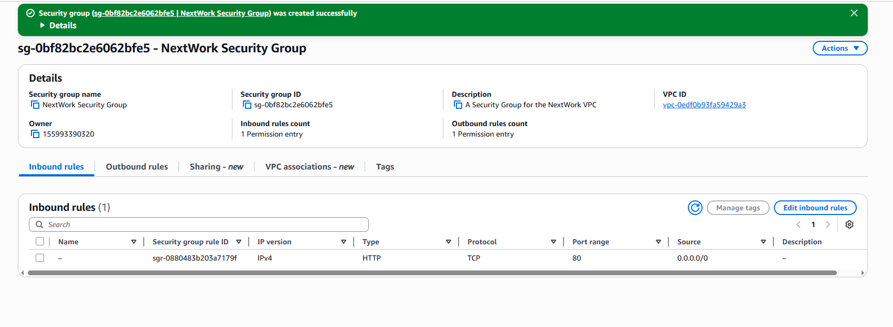
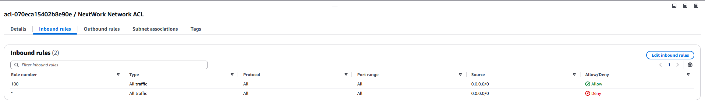
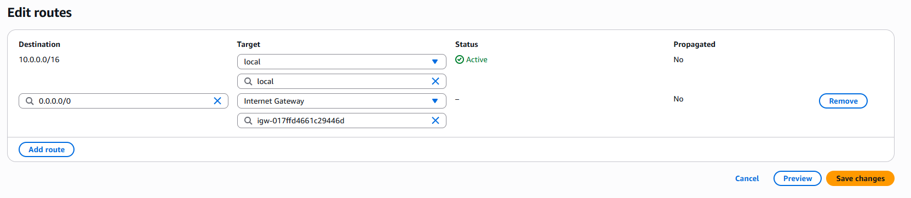

# AWS VPC Security Subproject

**Objective**: Secure your VPC by configuring Security Groups and Network ACLs.

---

## Security Group Configuration

1. **Create Security Group**

   * Name: `NextWork Security Group`
   * Description: Allow HTTP access
   * VPC: NextWork VPC

   
   *Figure: Security Group initialized with default outbound rule.*

2. **Add Inbound Rule**

   * Type: HTTP (TCP port 80)
   * Source: `0.0.0.0/0`

   
   *Figure: Security Group now allows HTTP traffic.*

---

## Network ACL Configuration

1. **Create Custom Network ACL**

   * Name: `NextWork Network ACL`
   * VPC: NextWork VPC

2. **Configure Inbound Rules**

   * Rule 100: Allow all traffic (0.0.0.0/0)
   * ∞: Deny all other traffic

   
   *Figure: Stateless ACL enforcing explicit allow/deny.*

3. **Associate with Public Subnet**

   * Targets: Public Subnet (`10.0.1.0/24`)

---

## Route Table Reminder

Ensure your public subnet’s route table still directs `0.0.0.0/0` to the Internet Gateway:


*Figure: Route table forwarding Internet traffic via IGW.*

---

## Key Concepts

* **Security Groups**: Virtual firewalls at the instance level (stateful).
* **Network ACLs**: Stateless filters at the subnet level.
* **Rule Ordering**: ACLs process rules by ascending rule number; “∞” is evaluated last.

---

## Repository Path

```text
aws-projects/
└── vpc/
    ├── project-01-vpc/
    └── project-02-vpc-security/
        ├── images/
        │   ├── security-group-created.png
        │   ├── security-group-inbound.png
        │   ├── inbound-rules.png
        │   └── route-setup.png
        └── README.md    ← this file
```

---

*Next up: Creating a Private Subnet*
