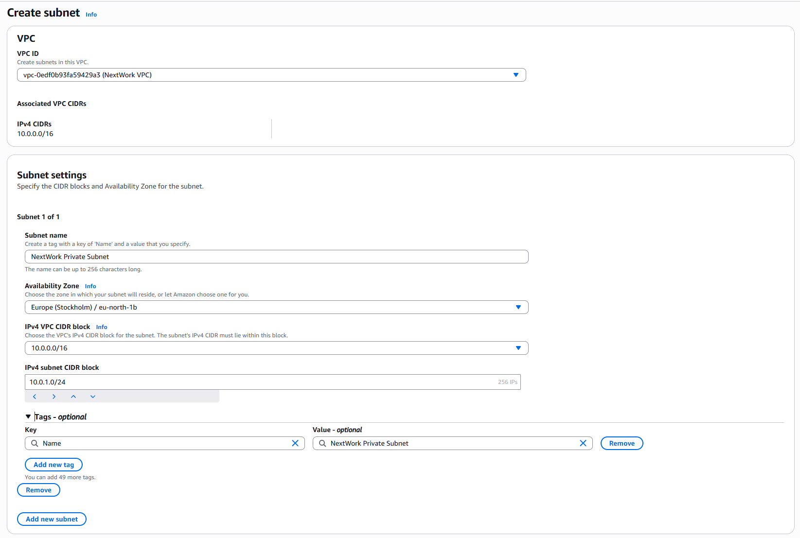
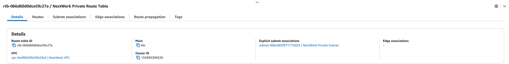
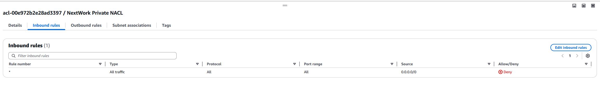

# AWS VPC Private Subnet Subproject

**Objective**: Create a private subnet within your VPC, configure a dedicated route table, and enforce subnet-level traffic control using a Network ACL.

---

## Subnet Creation

1. **Define Private Subnet**

   * **Name**: `NextWork Private Subnet`
   * **CIDR block**: `10.0.2.0/24`
   * **Availability Zone**: eu-north-1b (Stockholm)
   * **Auto-assign Public IPv4**: Disabled


*Figure: Creating the private subnet without public IP assignment.*

---

2. **Verify Subnet**
   
   *Figure: Private subnet appears under the VPC with no auto-assigned addresses.*

---

## Route Table Configuration

1. **Create a dedicated route table** for the private subnet.
2. **Associate** it explicitly with the private subnet (`10.0.2.0/24`).
3. **Routes:**

   * `10.0.0.0/16 → local` (default)

*No Internet Gateway route is added to keep the subnet private.*

---

## Network ACL Enforcement

1. **Create NACL**: `NextWork Private NACL` in the same VPC.
2. **Inbound Rules**:

   * `*` (all) → Deny (`0.0.0.0/0`)


*Figure: Stateless ACL blocking all inbound traffic.*

3. **Outbound Rules**: (optional—allow or restrict as needed)
4. **Associate NACL** with the private subnet.

---

## Key Points

* **Private Subnet**: Instances receive no public IPv4; must use NAT or VPN for egress.
* **Dedicated Route Table**: Controls routing separately from public subnets.
* **Network ACL**: Stateless, processes rules by ascending rule number, default “\*” rule applies last.

---

## Repository Structure

```text
aws-projects/
└── vpc/
    ├── project-01-vpc/
    ├── project-02-vpc-security/
    └── project-03-vpc-private/
        ├── images/
        │   ├── private-subnet-setup.png
        │   ├── private-subnet.png
        │   └── private-subnet-inbound-rules.png
        └── README.md    ← this file
```

---

*Next up: Launching VPC Resources*
