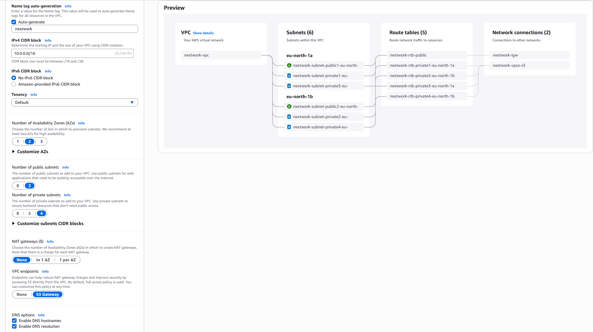
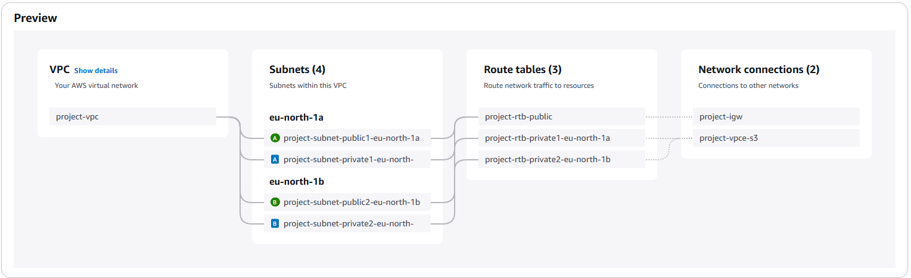
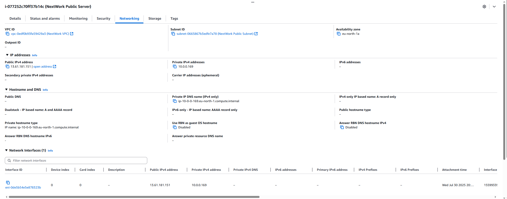
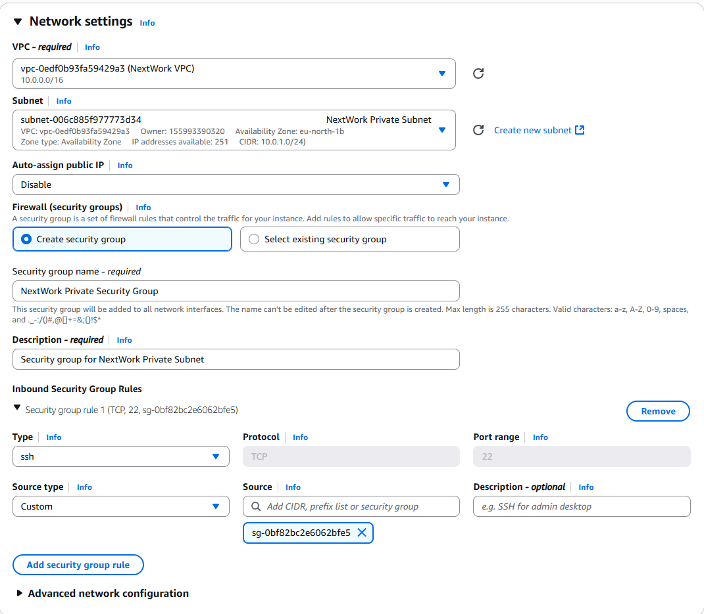

# AWS VPC EC2 Deployment Subproject

**Objective**: Launch and configure EC2 instances in both public and private subnets, with appropriate security settings.

---

## Quick VPC Recap


*Figure: VPC auto-generation with 2 public and 4 private subnets, an IGW, and S3 endpoint.*


*Figure: Resource map showing subnets, route tables, and connections.*

---

## 1. Launch Public EC2 Instance

1. **Select AMI & Instance Type**

2. **Network Settings**:

   * VPC: NextWork VPC
   * Subnet: Public subnet (auto-assign public IP)
   * Security Group: Allow HTTP (80) & SSH (22)

   
   *Figure: Public instance with public IPv4 and subnet details.*

3. **Verify Access**

   * Confirm Public IPv4 (e.g., `13.61.181.151`)
   * SSH into instance and serve a test web page.

---

## 2. Launch Private EC2 Instance

1. **Instance Setup**

   * Subnet: NextWork Private Subnet (no public IP)

2. **Security Group**:

   * Create `NextWork Private Security Group`
   * Inbound: SSH from Public Security Group only

   
   *Figure: Restrict SSH access to traffic originating from the public instance.*

3. **Connectivity Options**

   * Use Session Manager or a bastion host in the public subnet to SSH.

---

## Key Takeaways

* **Public Instance**: Direct Internet access via IGW; requires stricter security group rules.
* **Private Instance**: Isolated from Internet; access via bastion or AWS Session Manager.
* **Security Groups**: Stateful firewalls attached to NICs; rules immediately effective.

---

## Files & Structure

```text
aws-projects/
└── vpc/
    ├── project-01-vpc/
    ├── project-02-vpc-security/
    ├── project-03-vpc-private/
    └── project-04-vpc-ec2/
        ├── images/
        │   ├── vpc-and-more-setup.png
        │   ├── vpc-resource-map.png
        │   ├── ec2-networking-tab.png
        │   └── private-ec2-security-group-settings.png
        └── README.md    ← this file
```

---

*Next up: Testing VPC Connectivity*
