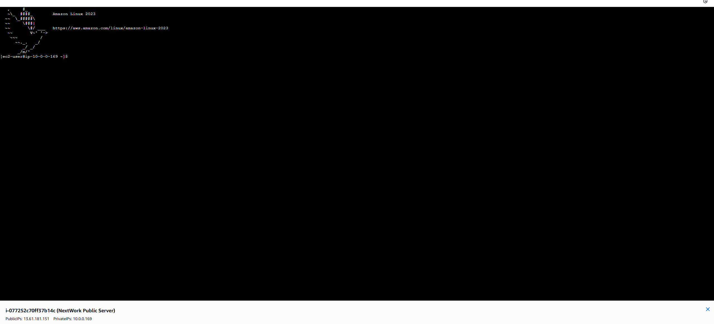
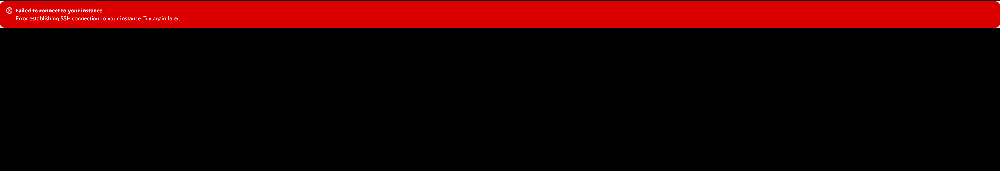

# AWS VPC Connectivity Subproject

**Objective**: Validate network connectivity across your VPC, including Internet access, inter-subnet communication, and secure instance access.

---

## 1. Internet Access Test

* **Curl from Public EC2**:

  ```bash
  curl https://learn.nextwork.org/projects/aws-host-a-website-on-s3
  ```

  
  *Figure: HTTP response returned HTML content, confirming outbound Internet access.*

---

## 2. Subnet-to-Subnet Ping

* **Ping Public Gateway IP** (`10.0.1.254`) from EC2:

  * **Success (public & private)**:
    
  * **Failure (private-only without NAT)**:
    

*Note: Public subnet instances can reach the IGW gateway address. Private-only subnets without a NAT cannot.*

---

## 3. EC2 Instance Connectivity

* **Public EC2** via AWS Console SSH:

  
  *Figure: Interactive shell on public instance (public IPv4: `13.61.181.151`).*

* **Private EC2** via Session Manager / Bastion:

  * Attempt direct SSH on private IP (`10.0.0.169`) fails:
    
  * Use a bastion host in the public subnet or AWS Systems Manager Session Manager to bridge.

---

## 4. Troubleshooting Tips

* **Security Groups**: Ensure inbound rules allow ICMP/TCP from the correct source.
* **Network ACLs**: Verify stateless rules don’t block return traffic.
* **Route Tables**: Private subnets need a NAT Gateway or endpoint for egress.
* **Instance Connect**: IAM permissions and OS-level SSH configs must permit connections.

---

## Key Takeaways

* Public instances have IGW‑backed Internet egress; private ones require NAT.
* Ping tests validate internal routing; curl tests validate external connectivity.
* AWS Session Manager provides secure shell access without public IPs.

---

## Repository Structure

```text
aws-projects/
└── vpc/
    ├── project-01-vpc/
    ├── project-02-vpc-security/
    ├── project-03-vpc-private/
    ├── project-04-vpc-ec2/
    └── project-05-vpc-connectivity/
        ├── images/
        │   ├── curl-command.png
        │   ├── successful-ping-responces.png
        │   ├── unsuccessful-ping-responce.png
        │   ├── ec2-connected.png
        │   └── connection-error.png
        └── README.md    ← this file
```

*Next up: VPC Peering*
